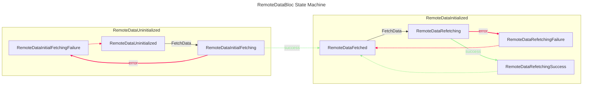
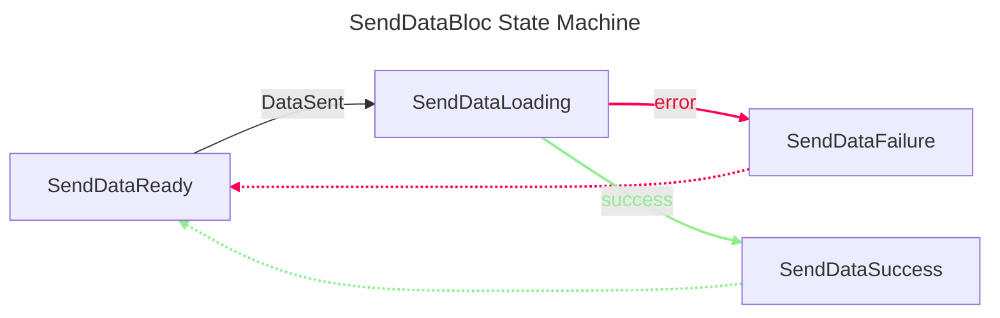
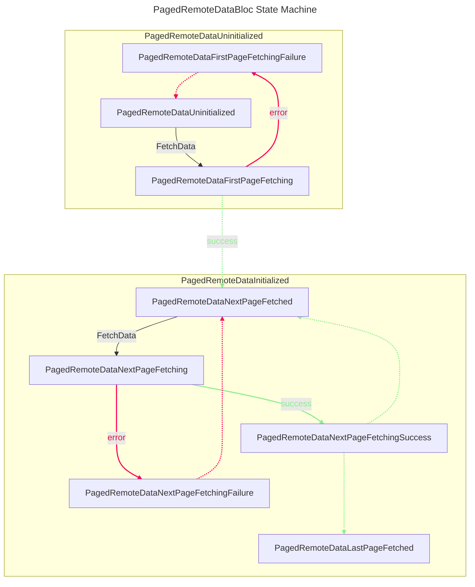
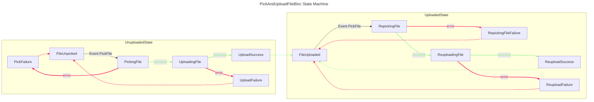

# Avilatek Bloc

[![style: very good analysis][very_good_analysis_badge]][very_good_analysis_link]
[](https://github.com/felangel/mason)
[![License: MIT][license_badge]][license_link]


A collection of useful blocs for Flutter applications, made with 💚 by Avila Tek.


## Installation 💻

**❗ In order to start using Avilatek Bloc you must have the [Flutter SDK][flutter_install_link] installed on your machine.**

Add `avilatek_bloc` to your `pubspec.yaml`:

```yaml
dependencies:
  avilatek_bloc:
```

Install it:

```sh
flutter packages get
```

## RemoteDataBloc


This bloc is a generalized state machine for handling data fetching. It abstracts the process of fetching data from the internet and provides a simple and consistent interface for handling the various states of the data fetching process.

It is useful for handling the process of fetching data from the internet, such as fetching a single item, a list of items, a file, etc. One of the advantages of this bloc, apart from its simplicity, is that it makes it possible to keep data in the UI while refetching, or to show the last fetched data in case of an error in a simple way.


Note: If you need to paginate the data, you may use the [`PagedRemoteDataBloc`](#PagedRemoteDataBloc) instead.

The `RemoteDataBloc` State Machine is as follows:


## SendDataBloc

This bloc is a generalized state machine to send data. It abstracts the process of sending payloads to a remote server and provides a simple and consistent interface for handling the various states of this process.

This bloc is useful for handling the process of sending data to a remote server, such as sending a form, sending a message, or sending a file. It does not care about storing any reference to the data being sent, it only cares about the process of sending the data. If you need to store the data before, during or after being sent, you may combine this with anouther bloc that stores it.


The `SendDataBloc` State Machine is as follows:


<a id="PagedRemoteDataBloc"></a>
## PagedRemoteDataBloc


This bloc is similar to `RemoteDataBloc`, but it is specialized for handling paged data. It abstracts the process of fetching paged data from the internet and provides a simple and consistent interface for handling the various states of the paginated data fetching process.

The `PagedRemoteDataBloc` State Machine is as follows:




## PickAndUploadFileBloc


This bloc defines a useful and generalized state machine for picking and uploading files to the internet. It abstracts the process of picking a file from any source and uploading it to a target location. 

The `PickAndUploadFileBloc` State Machine is as follows:




[flutter_install_link]: https://docs.flutter.dev/get-started/install
[github_actions_link]: https://docs.github.com/en/actions/learn-github-actions
[license_badge]: https://img.shields.io/badge/license-MIT-blue.svg
[license_link]: https://opensource.org/licenses/MIT
[logo_black]: https://raw.githubusercontent.com/VGVentures/very_good_brand/main/styles/README/vgv_logo_black.png#gh-light-mode-only
[logo_white]: https://raw.githubusercontent.com/VGVentures/very_good_brand/main/styles/README/vgv_logo_white.png#gh-dark-mode-only
[mason_link]: https://github.com/felangel/mason
[very_good_analysis_badge]: https://img.shields.io/badge/style-very_good_analysis-B22C89.svg
[very_good_analysis_link]: https://pub.dev/packages/very_good_analysis
[very_good_cli_link]: https://pub.dev/packages/very_good_cli
[very_good_coverage_link]: https://github.com/marketplace/actions/very-good-coverage
[very_good_ventures_link]: https://verygood.ventures
[very_good_ventures_link_light]: https://verygood.ventures#gh-light-mode-only
[very_good_ventures_link_dark]: https://verygood.ventures#gh-dark-mode-only
[very_good_workflows_link]: https://github.com/VeryGoodOpenSource/very_good_workflows
