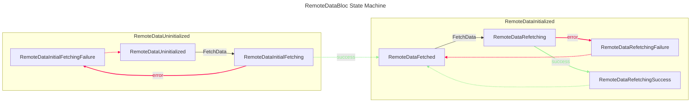
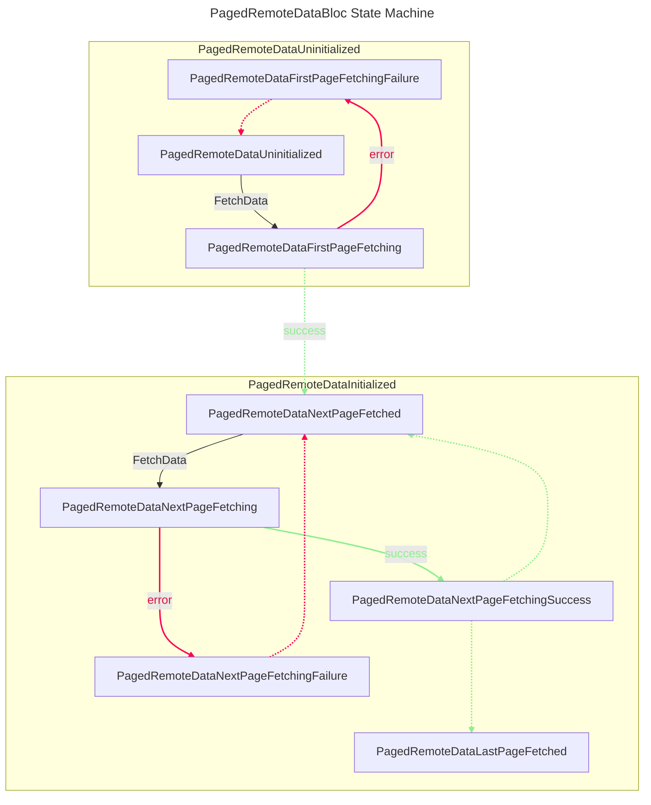
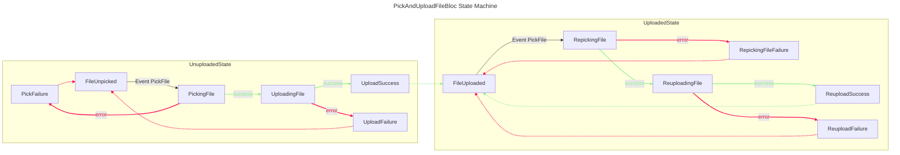

# avilatek_bloc

A collection of useful blocs for Flutter applications, made with 💚 by Avila Tek.

## RemoteDataBloc

### Introduction

This bloc is a generalized state machine for handling remote data. It abstracts the process of fetching data from the internet and provides a simple and consistent interface for handling the various states of the data fetching process.

The `RemoteDataBloc` State Machine is as follows:

## PagedRemoteDataBloc

### Introduction

This bloc is similar to `RemoteDataBloc`, but it is specialized for handling paged data. It abstracts the process of fetching paged data from the internet and provides a simple and consistent interface for handling the various states of the paginated data fetching process.

The `PagedRemoteDataBloc` State Machine is as follows:

## PickAndUploadFileBloc

### Introduction

This bloc defines a useful and generalized state machine for picking and uploading files to the internet. It abstracts the process of picking a file from any source and uploading it to a target location. 

The `PickAndUploadFileBloc` State Machine is as follows:

