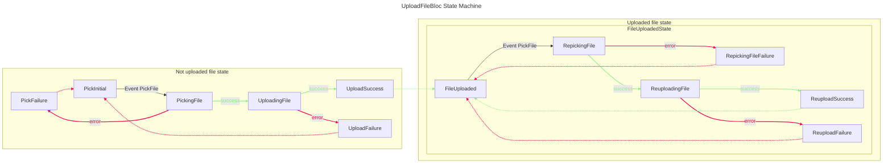

<!-- Embed ./sample.svg here -->

# UploadFileBloc

## Introduction

This bloc defines a state machine for file picking and uploading. It abstracts the process of picking a file from any source and uploading it to a target location, usually a remote server. 

The `UploadFileBloc` State Machine is as follows:




## Usage

The `UploadFileBloc` is a generic bloc that requires a `File` type. It is used as follows:

```dart